# VPN-yhteys

\

\

\

Tohtorikoulutettava/muu tiedettä tekevä pääsee lukemaan miltei kaikkia
keskeisiä lehtiä suoraan, jos yliopisto tarjoaa VPN-yhteyden avulla
tähän oikeuden. Esittelen seuraavassa luvun mahdollistavan workflow'n,
jos on Turun yliopistossa opiskelijana.

\

------------------------------------------------------------------------

\

\

\

1.  Imuroidaan VPN:ää varten client-softa Turun yliopistosta. Tämän
    kanssa saadaan luotua VPN-yhteys. Googleta "utushop" tai paina
    suoraan alle kirjaamaani linkkiä:

\

<https://utushop.utu.fi/>

\

\

------------------------------------------------------------------------

\

\

\

2.  Avautuu Utushopin kotisivut. Klikkaa oikeasta ylänurkasta "Kirjaudu
    sisään" (ks. kuva alla).

\

\

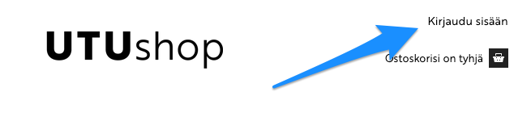\

------------------------------------------------------------------------

\

\

\

3.  Klikkaa kohtaan "Kirjaudu Turun yliopiston tunnuksilla" (ks. kuva
    alla). Kirjaudu tunnuksillasi.

\

\

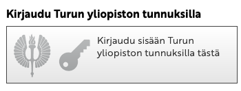\

\

\

------------------------------------------------------------------------

\

\

\

4.  Avautuu alla näkyvä näkymä, klikkaa kohtaan "IT-tuotteet".

\

\

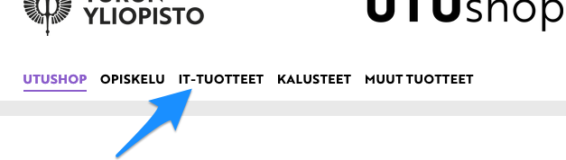\

\

------------------------------------------------------------------------

\

\

\

5.  Skrollaa alas ja klikkaa vasemman marginaalin paneelista kohtaan
    "Ohjelmistot":

\

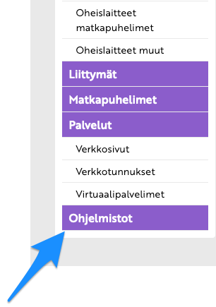\

\

------------------------------------------------------------------------

\

\

\

6.  Kirjoita sivuston ylälaitaan "vpn" ja paina enteriä:

\

\

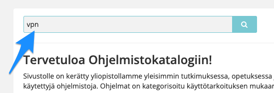\

\

\

------------------------------------------------------------------------

\

\

\

7.  Skrollaa alas kunnes näet kohdan AnyConnect VPN, klikkaa siihen:

\

\

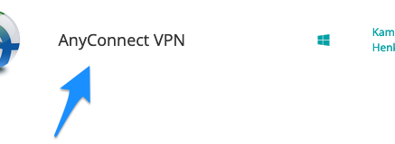\

\

\

------------------------------------------------------------------------

\

\

\

8.  Skrollaa alas kunnes näet painikkeen "Asennussivusto", klikkaa
    siihen:

\

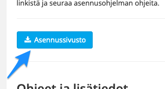\

\

\

\

------------------------------------------------------------------------

\

\

\

9.  Seuraavaksi pyydetään taas utu-tunnariasi ja -salasanaasi. Jos ja
    kun näkyy web-selaimen URL-osoitteena vpn.utu.fi-tyyppisen osoite
    (ks. kuva alla), uskallan itse tuohon tunnarini ja salasanani
    kenttään antaa (ks. kuva alla).

\

\

Ylhäällä pitäisi näkyä tällaisesti alkava osoite:

\

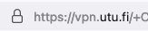\

\

\

Keskellä ruutua pitäisi näkyä tällainen kenttä:

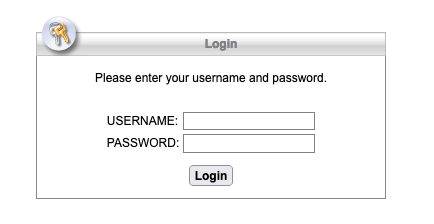\

\

\

------------------------------------------------------------------------

\

\

\

10. Nyt pääsee vihdoin painamaan linkkiä (kuva alla) ja saa AnyConnect
    Secure Mobility Clientin imuroitua ja sen jälkeen asennettua
    koneelleen. Jälleen web-selaimessa ylhäällä näkyy vieläkin
    vpn.utu.fi-tyyppinen osoite (kuva alla).

\

\

Ylhäällä pitäisi näkyä tällaisesti alkava osoite:

\

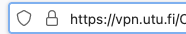\

\

\

Keskellä ruutua on linkki josta saa softan imuroitua koneelleen:

\

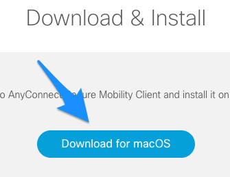\

\

\

\

------------------------------------------------------------------------

\

\

\

11. Kun olet asentanut kyseisen client-softan koneellesi, käynnistä se.
    Macintosh-tietokoneessa tämä käy nopeiten, kun painat ensin
    Command-nappulan pohjaan, pidät sitä pohjassa ja painat samalla
    välilyöntinappulaa (spacebar). Avautuu ns. spotlight-näkymä, josta
    pääset ohjelman käynnistämään (ks. seuraava kohta alta).
    Vaihtoehtoisesti voit käynnistää spotlight-näkymän painamalla
     kuvaruudun oikeasta ylänurkasta suurennuslasia, ks. kuva alla:

\

\

\

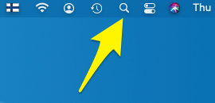\

\

\

\

------------------------------------------------------------------------

\

\

\

12. Avautuu ns. spotlight-näkymä, ja heti kun alat kirjoittaa siihen
    sanaa "Cisco...", todennäköisesti jo pari kirjainta kirjoitettuasi
    Macintosh tarjoaa kys. softaa käynnistettäväksi. Klikkaa kohtaan
    "Cisco AnyConnect Secure Mobility Client". Ks. kuva alla:

\

\

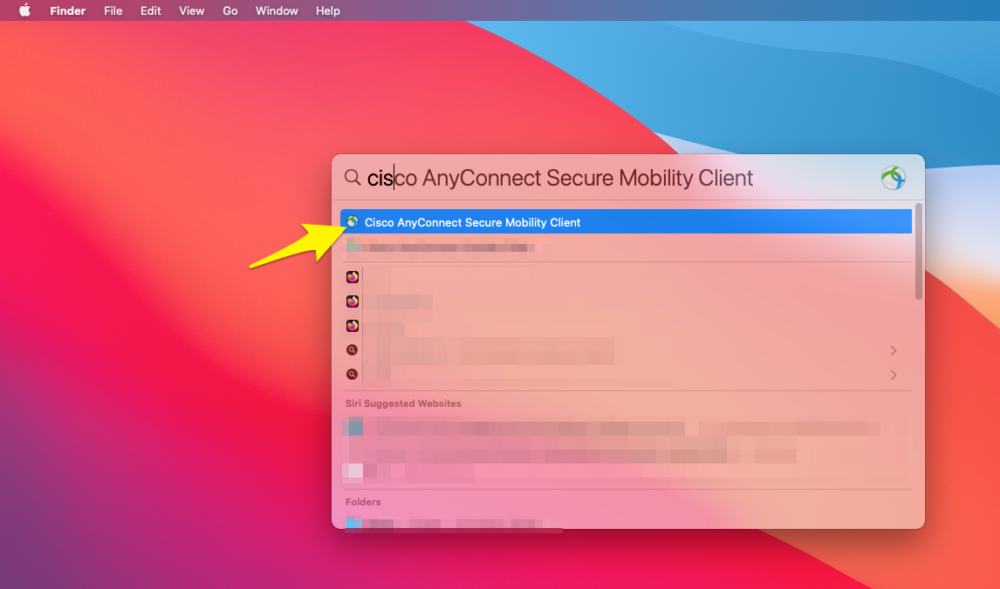\

\

\

\

------------------------------------------------------------------------

\

\

\

13. Client-softa käynnistyy. Kirjoita osoitteeksi client-softan näkymään
    vpn.utu.fi, jos se ei automaattisesti siinä jo näy. Klikkaa
    "Connect":

\

\

\

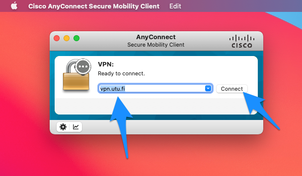\

\

\

\

\

------------------------------------------------------------------------

\

\

\

\

14. Client-softa kysyy vielä utu:n käyttäjätunnuksesi ja salasanasi. Kun
    yllä näkyy, että vpn.utu.fi-osoitteeseen ollaan VPN-yhteys luomassa,
    uskallan antaa oman käyttäjätunnukseni ja salasanani:

\

\

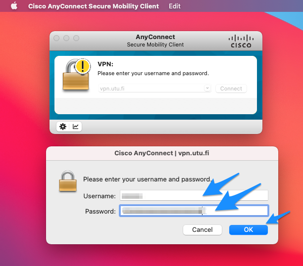\

\

\

\

------------------------------------------------------------------------

\

\

\

15. Onnistuneen VPN-yhteyden osoituksena näet seuraavalta näyttävän
    näkymän:

\

\

\

\

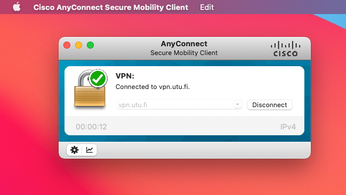\

\

\

\

------------------------------------------------------------------------

\

\

\

Kun VPN-yhteys on nyt muodostettu, pääset esim. PubMedin kautta
selaamaan kansainvälisiä artikkeleja. Siitä lisää seuraavassa
luvussa.

\

\

\

<a property="dct:title" rel="cc:attributionURL" href="https://vldesign.kapsi.fi/vpn-ja-viitteet/">Lehtiartikkelien haku utu:n VPN-yhteydellä ja viitteidenhallinta</a> by <a rel="cc:attributionURL dct:creator" property="cc:attributionName" href="http://www.linkedin.com/in/ville-langen">Ville Langén</a> is licensed under <a href="http://creativecommons.org/licenses/by-sa/4.0/?ref=chooser-v1" target="_blank" rel="license noopener noreferrer" style="display:inline-block;">CC BY-SA 4.0</a>
 