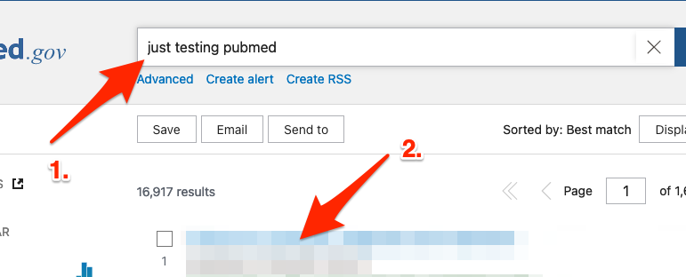
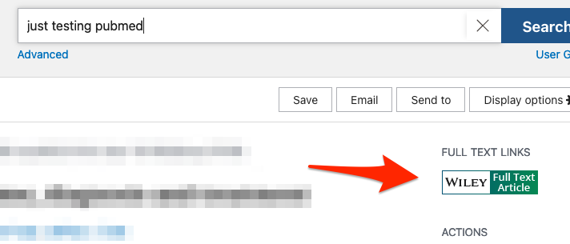
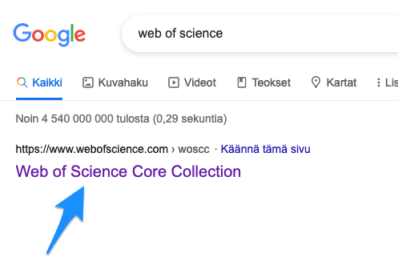
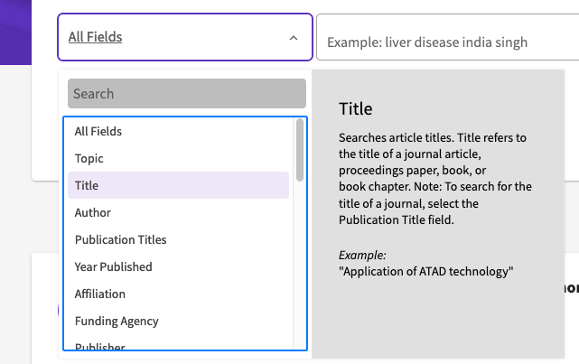
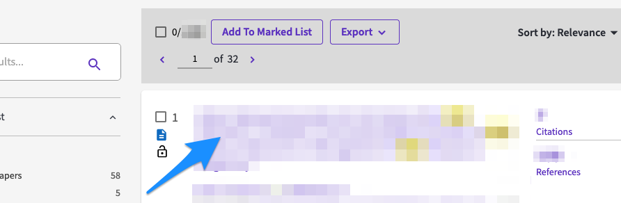
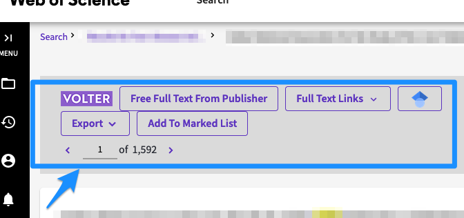
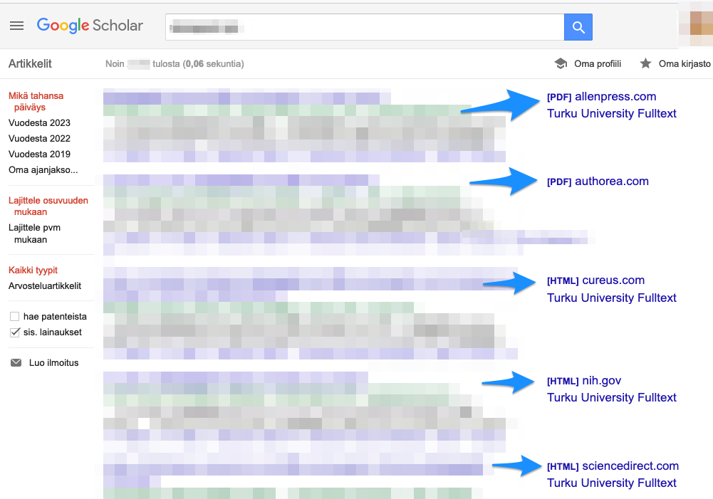
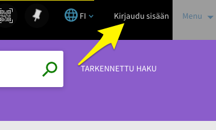
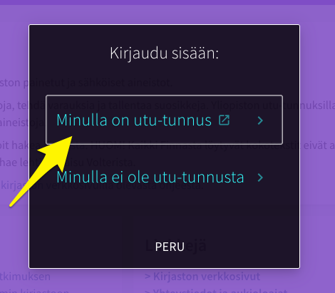
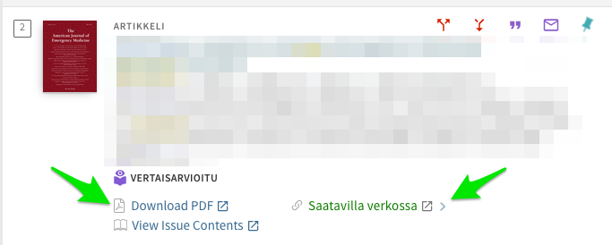

# Artikkelien haku

\

\

Edellisessä luvussa esittelin, miten utu:n VPN-yhteys muodostetaan.

\

Kun utu:n VPN-yhteys on muodostettu, monenlaisten portaalien kautta
tarjoutuu suora pääsy tieteellisiin artikkeleihin.

\

Esittelen seuraavassa muutamia näistä.

\

\

\

## PubMed

\

-   Googleta "Pubmed" tai klikkaa seuraavaa linkkiä:

\

<https://pubmed.ncbi.nlm.nih.gov/>

-   Etsi hakusanoilla jokin artikkeli ja klikkaa artikkelia (vrt. kuva
    alla, artikkelin nimi sumennettu tässä).

\

\

\

\

\

\

\

\

\

\

\

\

-   Kun olet klikannut artikkelin nimeä, pääset näkymään jossa näkyy
    oikeassa marginaalissa "Full Text Links", klikkaa niistä jotakin:

\

\

\

\

\

\

\

\

-   VPN-yhteyden ansiosta sinun pitäisi nyt päästä suoraan artikkelin
    elektroniseen versioon.

\

\

\

\

\

\

\

## Web of Science (WoS)

\

-   Googleta "web of science" (ks. kuva alla) tai klikkaa suoraan
    seuraavaa linkkiä:

\

<https://www.webofscience.com/>\

\

\

\

\

\

\

-   Avautuu hakunäkymä, jossa pääset valitsemaan ensin "Fieldin" jonka
    perusteella haetaan - on mahdollista suorittaa haku esim.
    lehtiartikkelin otsikon tai kirjoittajan nimen perusteella (tai jopa
    PubMed ID:n perusteella, jos olit jo löytänyt jonkun artikkelin
    PubMedin kautta ja haluat siitä lisää tietoa WoS:n puolelta):

\

\

\

\

\

\

\

\

-   Syötä joku haku ja valitse sitten jokin löytämäsi artikkeli
    klikkaamalla sitä (alla hakutulos sumennettu):

\

\

\

\

\

\

\

\

-   Voit tämän jälkeen nähdä erilaisia Full Text -tyyppisiä linkkejä,
    joita voit kokeilla päästäksesi lukemaan artikkelia:

\

\

\

\

\

\

\

\

## Google Scholar 

\

\

\

-   Joskus olla paikallaan etsiä artikkeleita Google Scholarin kautta.
    Googleta "google scholar" tai klikkaa alla olevan linkkiin:

\

<https://scholar.google.com/>

\

\

\

-   Jälleen tarjoutuu mahdollisuuksia päästä klikkaamaan artikkelien
    täysversioihin (hakutulokset sumennettuna):

\

\

\

\

\

\

\

## Utu Volter

\

-   Googleta "utu volter" (ks. kuva alla) tai klikkaa suoraan seuraavaa
    linkkiä:

\

<https://utuvolter.fi/>

\

\

\

\

-   Palveluun pitää vielä kirjautua sisään oikeasta ylänurkasta:

\

\

\

\

\

\

\

\

-   Klikkaa seuraavaksi kohtaan "Minulla on utu-tunnus", ja kun
    web-selaimen URL-osoitteena on utuvolter.fi-alkuinen URL-osoite,
    uskallan syöttää utu:n tunnukseni ja -salasanani, jolloin pääsee Utu
    Volterin palveluita käyttämään:

\

\

\

\

\

\

\

-   Kun etsii jotakin artikkelia hakusanalla, avautuu yleensä näkymä,
    josta pääsee klikkaamaan joko "Download PDF" tai "Saatavilla
    verkossa". Kumpikin linkki yleensä toimii, mutta näistä ensimmäinen
    on suorempi linkki artikkeliin:

\

\

\

\

\

\

\

\

## Suora googletus

\

-   Joissakin tilanteissa suora googletus on nopein keino löytää
    etsimänsä artikkeli. Tämä metodi ei kaipaa erikseen esittelyjä.

\

\

\

<a property="dct:title" rel="cc:attributionURL" href="https://vldesign.kapsi.fi/vpn-ja-viitteet/">Lehtiartikkelien haku utu:n VPN-yhteydellä ja viitteidenhallinta</a> by <a rel="cc:attributionURL dct:creator" property="cc:attributionName" href="http://www.linkedin.com/in/ville-langen">Ville Langén</a> is licensed under <a href="http://creativecommons.org/licenses/by-sa/4.0/?ref=chooser-v1" target="_blank" rel="license noopener noreferrer" style="display:inline-block;">CC BY-SA 4.0</a>
 